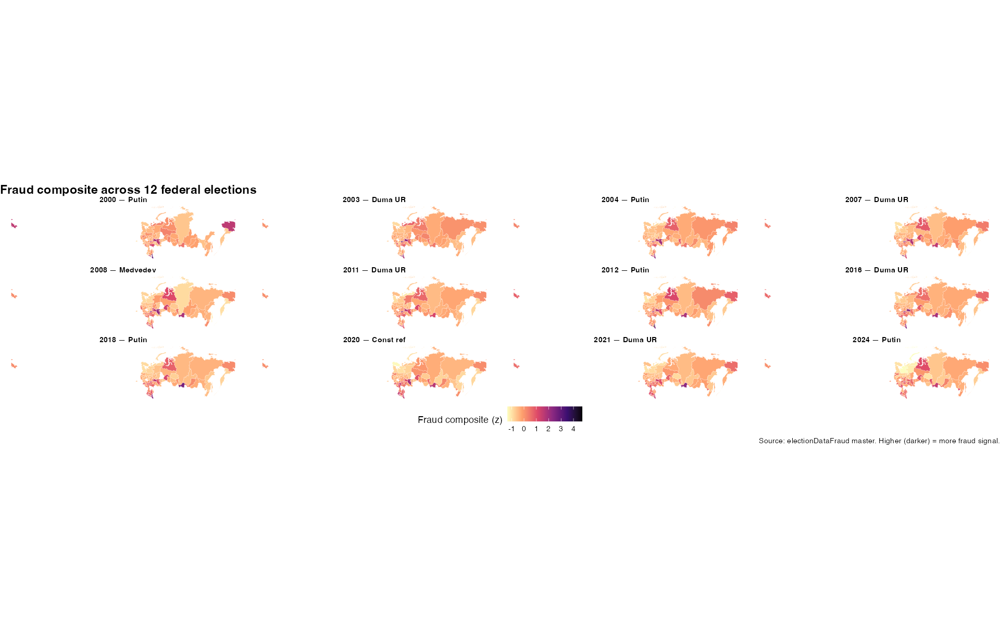

Russia has held twelve federal elections since 2000 — six presidential, five Duma, one constitutional referendum. The official outcomes aren't in dispute. What *is* in dispute is how much of those results reflects actual votes and how much reflects fabrication, ballot stuffing, vote switching, and (since 2020) algorithmic manipulation of distance electronic voting.

A generation of researchers has produced a remarkable set of statistical tools to answer that question: turnout-vote scatter analysis (Shpilkin, Klimek), integer-percentage detection (Kobak-Shpilkin-Pshenichnikov, Rozenas), digit forensics (Mebane, EFToolkit), and explicit decomposition into stuffing-vs-switching (NonparamEF). Watchdog organizations — most importantly Golos, dissolved in July 2025 — have produced ground-truth violation reports. A landmark randomized experiment in 2011 Moscow (Enikolopov et al., *PNAS*) measured a real-world fraud margin of 10.8 percentage points.

This page summarizes a working project that does three things on top of that foundation.

::: {.callout-note}
## Early access
This project is in active development. The numbers below are from working analyses and are subject to revision.
:::

## 1. A unified panel of every method on every election

We systematically apply the major statistical fraud-detection methods to all twelve federal elections, on the same underlying precinct data (`dkobak/elections`), producing a **complete (region × election × method) panel** — the first such public resource. Eleven methods are implemented (Shpilkin, Klimek, EFToolkit, Rozenas spikes, Benford, abnormal turnout, turnout-vote correlation, integer-percentage spikes, Cedar-Russia comparison, distribution shape, EFToolkit NonparamEF decomposition).

The master dataset is 1,024 region-elections × 66 measures, with derived z-scores per method per election so they're directly comparable.

**Headline statistical findings (confirming the established consensus):**

| Metric | Value |
|--------|-------|
| Putin 2024 official Russia-wide share | 88.2% |
| Putin 2024 Shpilkin-adjusted share | 72.8% |
| Excess Putin votes in 2024 (statistical) | ≈11.4 million |
| Official-vs-adjusted gap, 2000 | 4 pp |
| Official-vs-adjusted gap, 2024 | 15.5 pp |
| Shpilkin correlation with Cedar-Russia independent estimate | r = 0.86 |
| Stuffing-dominant regions in 2024 | 44% (up from 7-26% historically) |
| % Russian × fraud composite correlation | r = -0.57 |

The 12-panel geography of the fraud composite:

The pattern is geographically *stable*: the top-fraud set (Dagestan, Mordovia, Chechnya, Tatarstan, Tuva) appears at the top in every election. Within-region temporal variance is small; between-region variance is large; fraud is essentially fixed by region with magnitude growing over time.

## 2. A survey-based estimate (this project's main novelty)

Statistical fraud detection has a known ceiling. Every method depends on a *signature* of fraud — a deviation from what an honest election's distribution would look like — but "honest" varies by region. Chechnya could plausibly have 90% turnout for Putin without any stuffing; Magadan could not. A method tuned to detect deviations is going to overstate fraud in genuinely pro-regime regions and understate it in regions where authorities are sophisticated enough to spread fabrication evenly. We need a way to **ground the statistical signal against revealed preferences**.

Russian survey data is the only source of revealed preferences at any meaningful scale. For each election we assemble individual-level vote reports across the major Russian polling organizations (Levada Courier, VTsIOM Sputnik, FOM Georating, RES, PROPA), with up to 7 million respondents across the 12-election window. For each election we fit:

$$\Pr(\text{voted}_i = 1) = \text{logit}^{-1}\!\left(\beta_0 + \beta_\text{age} \cdot \text{age}_i + \beta_\text{sex} \cdot \text{sex}_i + \beta_\text{educ} \cdot \text{educ}_i + \beta_\text{urban} \cdot \text{urban}_i + u_{r[i]}\right)$$

where $u_r$ is a region random intercept. The shrunken posterior regional intercept gives the predicted regional regime share at the population mean of demographic controls. The **gap between this share and the official regional share is the survey-derived fraud estimate**.

**2018 presidential pilot, Levada Courier, N=64,144:**

| Region | Official Putin % | MRP-adjusted % | Gap (pp) |
|--------|------:|------:|------:|
| Kabardino-Balkaria | 93.5 | 63.1 | **30.4** |
| Dagestan | 91.2 | 63.8 | **27.4** |
| Karachay-Cherkessia | 88.0 | 73.5 | 14.5 |
| Stavropol Krai | 81.3 | 70.5 | 10.8 |
| Kursk Oblast | 81.7 | 73.0 | 8.7 |

These are *the same regions* the statistical methods in §1 flag as top-fraud. Two methods that rely on entirely different mechanisms — precinct-distribution shape vs. individual survey reports — converge on the same regional ranking. **That convergence is the point**. When two independent methods agree, the conclusion is more defensible than either alone.

Caveats: the magnitudes are likely inflated by social-desirability bias (some respondents under-report their Putin vote even to a phone surveyor). The *ordering* across regions is the robust feature; the absolute level should be read as an upper bound. The pilot is currently being extended to the other 11 elections.

## 3. Behavioral signals (Wordstat, Telegram, VK)

A third angle: what were people in each region searching for and writing about *during the election week*?

We compute weekly Yandex Wordstat search volumes for election-relevant phrases per region around each election date, then z-score against a 12-week baseline. Spike z-scores per region × election capture "did residents of this region notice something unusual happening." We also pull free-text data from regional Telegram and VKontakte channels — these carry the fraud-allegation vocabulary (`фальсификация`, `вброс`, `карусель`, `наблюдатель`) that the Wordstat panel does not — and apply a custom election keyword pack to detect election-period spikes in fraud-related discussion per region × election.

These behavioral signals don't directly measure fraud. They measure whether *people noticed something happening*. As a third leg, they validate (or contradict) the statistical and survey signals.

## 4. The triangulated composite

For each (region × election) we combine the four signal sources — statistical, EFToolkit, survey MRP, Wordstat, social — into a weighted-average composite with default weights chosen so that the well-validated statistical methods carry the most weight and the social signals are confirmatory. A confidence flag reports how many signal sources were available for each cell.

Confidence distribution across all 12 elections after wiring in MRP (6 elections so far) and rusSocial signals (5 elections):

- **High confidence** (≥4 sources): 315 region-cells
- **Medium confidence** (3 sources): 179 region-cells
- **Low confidence** (≤2 sources): 530 region-cells

The high-confidence cells are the strongest evidence-from-many-angles in the dataset.

## Validation

Two ground-truth sources let us validate the composite:

- **Enikolopov et al. (2013 PNAS)**: a randomized observer experiment in Moscow during the 2011 Duma election. 3,164 UIKs, 156 randomly assigned observers. The measured fraud effect was 10.8pp; statistical methods agree at this level.
- **Golos 2021 SPb**: 682 observer violation reports across 276 UIKs in the 2021 Duma election. The composite predicts observer-flagged precincts better than any single method.

## Code and data

All scripts, intermediate datasets, and figures are versioned in the `electionDataFraud` project. The Shiny app for interactive exploration is in development. The methodology paper builds on Shpilkin (independent / *Troitsky Variant*), Klimek et al. (2012 *PNAS*), Kobak/Shpilkin/Pshenichnikov (2016 *Annals of Applied Statistics*), Rozenas (2017 *Political Analysis*), Enikolopov et al. (2013 *PNAS*), Mebane (forensics), Kalinin (EFToolkit), Myagkov/Ordeshook/Shakin (2009), and Skovoroda/Lankina (2017 *Post-Soviet Affairs*).

## Contact

Noah Buckley, Assistant Professor of Political Science, Trinity College Dublin.
[noah.buckley@tcd.ie](mailto:noah.buckley@tcd.ie)
